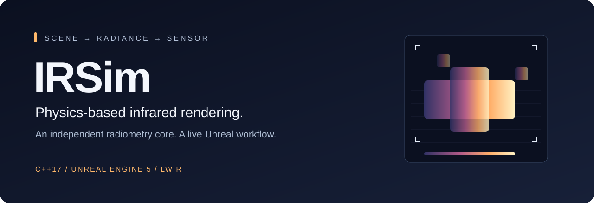
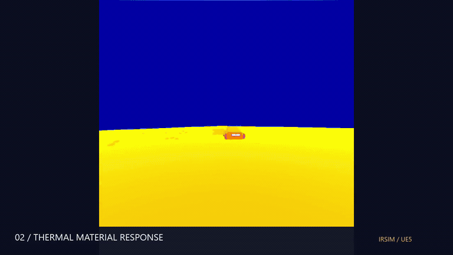
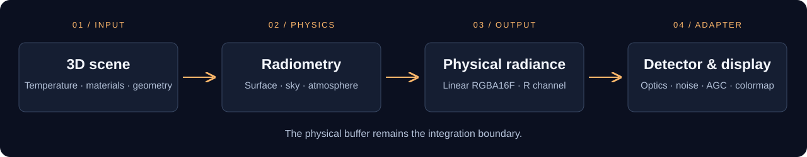

<p align="center">
  
</p>

<p align="center">
  <strong>From a 3D scene to infrared radiance, with physics you can inspect.</strong><br>
  An independent C++17 core, reusable Unreal components and a detector-processing demo.
</p>

<p align="center">
  
  
  
  
</p>

<p align="center">
  <a href="#see-it-in-action">Demo</a> ·
  <a href="#get-started">Get started</a> ·
  <a href="Documentation/INTEGRACION.md">Integration guide 🇪🇸</a> ·
  <a href="Documentation/ROADMAP.md">Roadmap 🇪🇸</a> ·
  <a href="https://github.com/JoseMorenob">Author</a>
</p>

## See it in action

[](https://github.com/JoseMorenob/thermalSimulationUnreal/blob/main/Documentation/Media/irsim-showcase.mp4)

**[Watch / download the full demo — MP4, ~44 seconds](https://github.com/JoseMorenob/thermalSimulationUnreal/raw/refs/heads/main/Documentation/Media/irsim-showcase.mp4)**

Actual project recordings: a vehicle scene, live temperature controls, a hangar, industrial geometry and the detector-processing demonstration. The animation above plays directly in the README; the full video includes all eight sequences. The recordings retain the original Spanish editor and runtime interface.

## What it does

IRSim computes the infrared radiance reaching a virtual sensor from surface temperature, material optical properties, an effective sky and a simplified atmosphere. Unreal renders the physical result into a linear floating-point target. A separate adapter demonstrates how a detector pipeline can consume that target and produce a displayed image.

The project began as my completed MSc thesis at **U-tad**. Development now continues toward a more complete integration workflow for simulation and synthetic vision data.

| Capability | In the repository |
|---|---|
| **Inspectable physics** | Planck spectral radiance, numerical band integration, Fresnel conductor reflectance and Beer–Lambert transmission in an engine-independent C++17 library. |
| **Reusable thermal surfaces** | `IRThermalSurfaceComponent` connects a static mesh to the scene environment and material parameters. |
| **Physical capture** | Band-integrated radiance in the R channel of a linear `RGBA16F` render target, in W·m⁻²·sr⁻¹. |
| **Live exploration** | Runtime controls and debug views for radiance, temperature, emissivity, depth, normals and material ID. |
| **Detector demonstration** | `IRPipelineActor` bridges physical radiance to the separate `IRPipelineCore` library, with editable optics, calibration, lag, noise, AGC and colormap settings. |
| **Verification tools** | Standalone core tests and five Unreal automation cases covering CPU/GPU agreement, atmosphere, auxiliary buffers and angular Fresnel behaviour. |

## How it fits together



The integration boundary is `RadianceCaptureActor`: consumers can obtain its physical render target or subscribe to `OnRadianceFrameCaptured`. Downstream processing keeps its own output target, preserving the physical capture for inspection and comparison.

| Layer | Location | Responsibility |
|---|---|---|
| Physics core | [`lib/`](lib/) | Radiometry in C++17, built independently with CMake. |
| Unreal runtime plugin | [`Plugins/IRSimPlugin/`](Plugins/IRSimPlugin/) | Thermal components, environment, capture, runtime UI and material assets. |
| Detector adapter | [`Source/IRSimClean/`](Source/IRSimClean/) | Readback, detector configuration and presentation of the processed image. |
| Detector dependency | [`Source/IRPipelineCore/`](Source/IRPipelineCore/) | Supplied API header and Win64 static library; implementation source is not included here. |
| Demo scenes | [`Content/Maps/`](Content/Maps/) | `IRRadianceDemo`, `IRBufferValidation`, `IRCarScene`, `UAV` and `PIPES`. |

## Get started

### Run the Unreal demo

The checked-in project targets **Unreal Engine 5.6 on Windows x64**. Install Visual Studio with C++ tools suitable for UE 5.6.

```powershell
git clone https://github.com/JoseMorenob/thermalSimulationUnreal.git
cd thermalSimulationUnreal
```

1. Open `IRSimClean.uproject` and rebuild the project modules if prompted.
2. Open `/Game/Maps/IRRadianceDemo` for the basic radiance demonstration.
3. Press **Play**, then **I** to show or hide the runtime control panel.
4. Explore surface and air temperature, atmosphere settings and the available debug buffers.

The repository includes both the radiometry plugin and the detector demo's Win64 libraries. Unreal modules are built with Unreal Build Tool. Other engine versions and plugin platforms have not been established as supported targets.

### Build the independent physics core

Requires **CMake 3.20+** and a **C++17 compiler**. Unreal is not needed for this target.

```sh
cmake -S . -B build -DCMAKE_BUILD_TYPE=Release -DBUILD_TESTING=ON
cmake --build build --config Release
ctest --test-dir build -C Release --output-on-failure
```

### Add the plugin to your own scene

Copy `Plugins/IRSimPlugin` into your Unreal project's `Plugins` directory. Add an environment, a capture actor and a pipeline controller; attach `IRThermalSurfaceComponent` to the meshes you want to include. Configure the material and actor references as described in the **[integration guide](Documentation/INTEGRACION.md)**.

The detector adapter lives in the demo project and has its own dependency. Copying the radiometry plugin alone gives you the physical capture stage.

## Validation and scope

The Unreal automation suite contains `CpuGpu`, `Atmosphere`, `AuxiliaryBuffers`, `FresnelAngular` and `AtmosphereEmission`. Run it from **Tools → Test Automation** using the filter `IRSimClean.Radiance`.

These checks evaluate defined numerical and rendering cases. They do not establish calibration against a particular real camera. The atmosphere and sky are simplified; complete thermal dynamics, measured material spectra and a calibrated end-to-end sensor model remain areas for further development. The demo's detector effects form a separate processing stage.

## Continuing after the thesis

The next milestone is a complete, repeatable integration experience: clearer configuration, a reproducible detector handoff, broader scene validation and eventually synchronized RGB/IR export with metadata. Planned work and acceptance criteria are tracked in the **[roadmap](Documentation/ROADMAP.md)**.

## Author

**José Moreno Barbero** · C++ software, avionics and simulation

[GitHub](https://github.com/JoseMorenob) · [LinkedIn](https://www.linkedin.com/in/jose-moreno-barbero/)

Project presentation is in English; technical documentation is maintained in Spanish. The showcase is built from project recordings; its reproducible edit is in [`Scripts/render_showcase.py`](Scripts/render_showcase.py).
